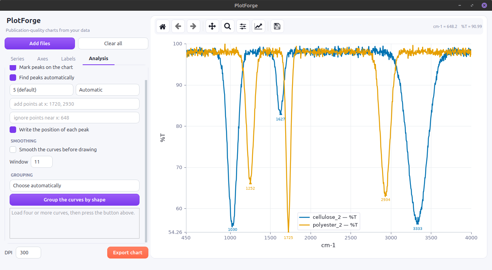

# PlotForge

Desktop application for turning raw laboratory data into publication-quality
charts, with built-in peak detection and unsupervised grouping of samples.

Built with Python, PySide6 and Matplotlib.



## Why

Instrument output is rarely tidy. A spreadsheet exported from a
spectrometer often starts with several title rows, carries an unnamed
annotation column beside the data, and arrives in a different format from
the next instrument. Researchers then either clean it by hand, pay for a
closed commercial tool, or write their own plotting code.

PlotForge reads those files directly, works out their structure, and gives
full control over the chart through a graphical interface — no coding
required.

## Features

**Reading data**

- Accepts `.xlsx`, `.xls`, `.csv`, `.txt` and `.dat`
- Detects the header row automatically, even when title rows sit above it
- Detects the delimiter of text files automatically
- Drops unnamed annotation columns and converts text numbers to real numbers
- Loads several files at once and reports which ones failed and why

**Charting**

- Line, scatter, line-with-markers and bar charts
- Error bars taken from any column
- Three layouts: everything overlaid, one panel per file, or one panel per
  quantity
- Manual or automatic axis ranges, reversed axes, custom tick spacing
- Editable chart title, axis labels and legend entries
- Per-curve colour, line style and width
- Interactive zoom and pan
- Export to PNG, PDF or SVG at a chosen DPI

**Analysis**

- Peak detection based on prominence rather than height, so noise on top of
  a strong peak is not mistaken for a peak of its own
- Automatic detection of whether peaks point up or down, which matters for
  transmittance spectra
- Manual control: add points by hand, ignore unwanted automatic ones, or
  switch automatic detection off entirely
- Savitzky-Golay smoothing, which suppresses noise without flattening peaks
- Unsupervised grouping of samples by curve shape, using PCA for the map and
  k-means for the grouping, with the number of groups chosen by silhouette
  score rather than fixed in advance

## Installation

```bash
python3 -m venv .venv
source .venv/bin/activate        # Windows: .venv\Scripts\activate
pip install -r requirements.txt
python3 main.py
```

### Linux note

If Qt fails to start with an `xcb` platform plugin error:

```bash
sudo apt install libxcb-cursor0
```

## Trying the analysis features

The `demo/` folder holds twelve simulated spectra in three families.
Load all of them, set the horizontal axis to `cm-1`, open the **Analysis**
tab and press **Group the curves by shape**. The application should report
three groups that match the file names.

## Project structure

```
plotforge/
├── main.py              Entry point
├── core/                Business logic, independent of the interface
│   ├── io/
│   │   └── readers.py   File reading and structure detection
│   └── analysis/
│       ├── peaks.py     Peak detection and smoothing
│       └── clustering.py  PCA, k-means and cluster validation
├── gui/                 PySide6 interface
│   ├── main_window.py   Window, controls and plotting
│   ├── canvas.py        Matplotlib canvas embedded in Qt
│   └── style.py         Theme for the interface and the charts
├── demo/                Sample data
└── resources/           Icons and screenshots
```

The `core` package never imports PySide6. Keeping that boundary means the
analysis code can be tested without opening a window, and the interface can
change without touching the logic.

## Design notes

**Prominence, not height.** A peak is judged by how far it rises above the
valleys around it. Judged by height alone, a small bump sitting on a tall
peak would outrank a genuine but shorter peak elsewhere. The threshold is
expressed as a percentage of the signal range, so one setting works for any
unit of measurement.

**Colour-blind safe palette.** Curves use the Okabe-Ito palette by default,
since printed figures are often read by people who cannot separate red from
green.

**Honest clustering.** k-means always returns an answer, even for data with
no real structure, so the silhouette score is shown alongside the result and
a warning appears when separation is weak. Grouping is refused below four
curves: with two samples PCA reports 100% of the variance by construction,
which is arithmetic rather than a discovery.

## Limitations

- Grouping is only meaningful with many comparable samples; it is not useful
  for two or three files
- k-means assumes roughly round clusters and will struggle with elongated or
  nested shapes
- Curve fitting and equation plotting are not implemented yet

## License

MIT
